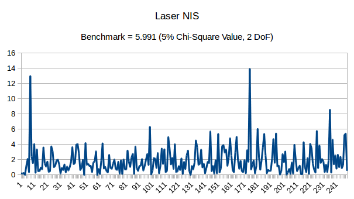
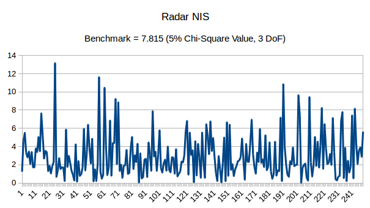

# Unscented Kalman Filter Project Starter Code
Self-Driving Car Engineer Nanodegree Program

## Note:

This repository contains my source codes for the Unscented Kalman Filter Project of Term 2 in the Udacity Self-Driving Car Engineer Nanodegree Program. The original problem and instructions can be found [here](https://github.com/udacity/CarND-Unscented-Kalman-Filter-Project).

## Basic Build Instructions

1. Clone this repo.
2. Make a build directory: `mkdir build && cd build`
3. Compile: `cmake .. && make`
4. Run it: `./UnscentedKF path/to/input.txt path/to/output.txt`. You can find
   some sample inputs in 'data/'.
    - eg. `./UnscentedKF ../data/obj_pose-laser-radar-synthetic-input.txt`

## Background

In this project, we extend the concepts used in the [extended Kalman filter project](https://github.com/lowspin/CarND2-Proj01-Extended-Kalman-Filter) to the Unscented Kalman Filter. As before, Udacity has provided simulated lidar and radar measurements detecting a bicycle that travels around a vehicle with laser and radar sensors, and we will use the Kalman filter to combine both lidar measurements and radar measurements to track the bicycle's position and velocity. The objective of this project is to use the Unscented Kalman filter to improve sensor fusion performance of the extended Kalman Filter. This is possible because the Unscented Kalman Filter uses the Constant Turn Rate and Velocity (CTRV) model and do not use linear approximations to fit the non-linear process models and instead rely on a gaussian assumption for the final distribution.

## Files in the src Folder
The following are the main files in the src folder:
- **main.cpp** - reads in data sequentially, calls the `ProcessMeasurement` function to run the Kalman filter, calls the `CalculateRMSE` function to calculate RMSE.
- **ukf.cpp** - main function to process each measurement, defines the predict function, the update function for lidar, and the update function for radar
- **tools.cpp** - function to calculate RMSE
The only file I modified for this project is **ukf.cpp**.

## Data format

The repo contains one data files (in /data):
- obj_pose-laser-radar-synthetic-input.txt

Data are presented in rows, e.g.
```
R	8.46642	0.0287602	-3.04035	1477010443399637	8.6	0.25	-3.00029	0
L	8.44818	0.251553	1477010443449633	8.45	0.25	-3.00027	0
R	8.57101	0.0282318	-0.0105258	1477010443499690	8.45	0.25	0	0
L	8.45582	0.253997	1477010443549747	8.45	0.25	0	0
R	8.42927	0.0301427	-1.85813	1477010443604698	8.35	0.25	-1.81979	0
L	8.23962	0.24916	1477010443659650	8.25	0.25	-1.81978	0
R	7.9351	0.0237437	-3.81077	1477010443709653	8.05	0.2	-3.99976	-0.99994
L	7.84073	0.159858	1477010443759657	7.85	0.15	-3.99972	-0.99993
R	7.61428	0.0204653	-3.22052	1477010443809660	7.7	0.15	-2.99982	0
L	7.54016	0.159641	1477010443859663	7.55	0.15	-2.99982	0
```

Each row represents a sensor measurement where the first column tells you if the measurement comes from radar (R) or lidar (L).

For a row containing radar data, the columns are: **sensor_type, rho_measured, phi_measured, rhodot_measured, timestamp, x_groundtruth, y_groundtruth, vx_groundtruth, vy_groundtruth**

For a row containing lidar data, the columns are: **sensor_type, x_measured, y_measured, timestamp, x_groundtruth, y_groundtruth, vx_groundtruth, vy_groundtruth**

Whereas radar has three measurements (**rho, phi, rhodot**), lidar has two measurements (**x, y**).

## Performance Measure

We will use the measurement values and timestamp in our Kalman filter algorithm. Groundtruth, which represents the actual path the bicycle took, is used for calculating **root mean squared error** for both position (x,y) and speed (vx,vy), which are used as the final performance metrics.


## Project Evaluation Rubrics

### Compiling
Code compiled without errors with `cmake` and `make` using the Basic Build Instructions above.

### Accuracy
RMSE values for px, py, vx, vy:

| RMSE          | px        | py        | vx       | vy       |
|:--------------|:----------|:----------|:---------|:---------|
| Laser only    | 0.110825  | 0.0972601 | 0.613797 | 0.249694 |
| Radar only    | 0.151946  | 0.194988  | 0.379798 | 0.346756 |
| **Laser + Radar** | **0.0690528** | **0.0832843** | **0.3393** | **0.225877** |

### Algorithm
#### 1. General Processing Flow

General Processing follows the initialize->Predict->Update->Predict->Update->.... cycle. Initialization of various UKF variables, mean vectors and covariance matrices are handled in the constructor of the UKF class (ukf.cpp:14-74). First measurements and timestamp are initialized in the `ProcessMeasurement()` function (ukf.cpp:90-126). Prediction and Update functions are handled by the `Prediction()`(ukf.cpp:154-271) and `UpdateLidar()`(ukf.cpp:277-358) for lidar or `UpdateRadar()` (ukf.cpp:364-466) for radar.

#### 2. First Measurements

First measurements are handled appropriately in the `ProcessMeasurement()` function (ukf.cpp:90-126).

#### 3. Predict first then update

Upon receiving a measurement after the first, the algorithm predict object position to the current timestep (ukf.cpp:132-136) and then update the prediction using the new measurement (ukf.cpp:141-146). 

In the Prediction function, first a set of sigma points are generated (ukf.cpp:160-189), then prediction is done using the chosen sigma points (ukf.cpp:195-238). Finally, the mean and covariance function of the predicted points are calculated (ukf.cpp:244-269.

In both LIdar and Radar update functions, the process flow follows the general Unscented Kalman Filter procedure - first the same set of sigma points are mapped to the measurement space, and the resulting mean and covariance matries are updated, linearly added with the noise covariance matrix (ukf.cpp:283-322(Lidar), 370-420(Radar)). Then the Kalman gain is calculated and the new state vector and covariance matrix are calculated (ukf.cpp:328-352(Lidar), 426-460(Radar)). Finally, the Normalized Innovation Squared (NIS) value is generated to check for consistency and to adjust the initial noise estimates (ukf.cpp:357(Lidar), 465(Radar)).

#### 4. Handle both radar and lidar measurements

The `ProcessMeasurement()` function calls `UpdateLidar()` if it is a lidar measurement (ukf.cpp:145) and `UpdateRadar()` if it is a radar measurement (ukf.cpp:142).

### Process Noise Estimates
The initial noise variance given for the process noise are far too high for a bicycle. I used a more realistic estimated scenario of 0-22mph in 20sec for urban bicycle riding as a basis. This works out to be 1.77 m/s^2 and using the rule of thumb of half of the realistic accerleration, I set the initial noise variance to be 0.88^2, yielding a std_a of 0.88. For the yaw acceleration, I used my own estimate of how fast a bicycle can change it's yaw angle and used a rough value of 0.3 rad/s^2 which corresponds roughly to 17degrees/s^2.

These two noise values worked out well, and I checked for consistencies using the NIS values as shown below:





As observed, both sets of NIS values behave appropriately within the recommended 5% chi-squared values based on their respectively degrees of freedom (2 for lidar and 3 for radar), i.e. about 10-20% of values exceed the benchback. 

### Single Sensor versus Sensor Fusion
As shown in the accuracy table above, turning off either laser/lidar or radar updates results in lower RMSE values. In particular, radar is much worse then lidar in measuring position, while radar seems more consistent in measuring velocity. Lidar's velocity estimate is more accurate in one direction (y) then the other (x), which indicated the target may be moving generally broadside. Finally, when the measurements from both radar and lidar are fused, all of the accuracy values are greatly improved, i.e. significant gain can be realized by sensor fusion using Kalman filter. 

## Conclusion

In this project, we've implemented the Unscented Kalman Filter algortihm to fuze measurements from two sensors - lidar and radar to track a moving target. Lidar sensors have accurate range and position measurement capabilities while radar can measure more accurate radial velocity using doppler. Using sensor fusion, we can make use of both sensors and achieve a more accurate measurement than a single sensor. In addition, the Unscented Kalman Filter is able to achived a better performance than the original or extended Kalman filter, because we do not assume a linear motion for the target (original KF) and do not use linear approximations for the non-linear process models (extended KF). The project is written in C++. 

